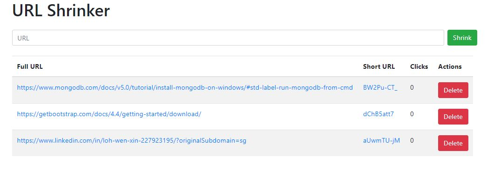

# url-shortener
This project is a DIY URL-shortener that helps the user shorten a URL. The website also keeps track of all URLs the user has shortened, as well as the number of clicks per shortened URL.




## Installation
Ensure that you have MongoDB and NPM installed on your local machine.

Install the dependencies and start the project.
```sh
npm run devStart
```

Navigate to http://localhost:5000/


## Technology Stack
This project was built with Node.js, Express, and MongoDB.